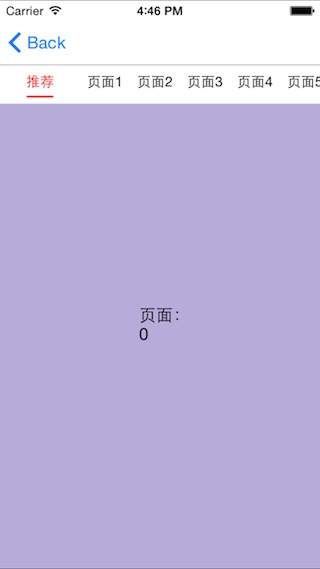

# DLSlideView

DLSlideView对常见的顶部Tab页点击、滑动分页做了封装。
它使用基于ViewController的container特性（而不是scrollview）来管理各个子页面，保留原始的系统消息，没有隐患。
同时内存模型更优于使用scrollview的方式，理论上可以支持无限分页。


可自定义标签栏：


使用方法：

1.初始化DLTabedSlideView
``` objective-c
self.tabedSlideView.baseViewController = self;
self.tabedSlideView.tabItemNormalColor = [UIColor blackColor];
self.tabedSlideView.tabItemSelectedColor = [UIColor colorWithRed:0.833 green:0.052 blue:0.130 alpha:1.000];
self.tabedSlideView.tabbarTrackColor = [UIColor colorWithRed:0.833 green:0.052 blue:0.130 alpha:1.000];
self.tabedSlideView.tabbarBackgroundImage = [UIImage imageNamed:@"tabbarBk"];
self.tabedSlideView.tabbarBottomSpacing = 3.0;
DLTabedbarItem *item1 = [DLTabedbarItem itemWithTitle:@"最新" image:[UIImage imageNamed:@"goodsNew"] selectedImage:[UIImage imageNamed:@"goodsNew_d"]];
DLTabedbarItem *item2 = [DLTabedbarItem itemWithTitle:@"最热" image:[UIImage imageNamed:@"goodsHot"] selectedImage:[UIImage imageNamed:@"goodsHot_d"]];
DLTabedbarItem *item3 = [DLTabedbarItem itemWithTitle:@"价格" image:[UIImage imageNamed:@"goodsPrice"] selectedImage:[UIImage imageNamed:@"goodsPrice_d"]];
self.tabedSlideView.tabbarItems = @[item1, item2, item3];
[self.tabedSlideView buildTabbar];
self.tabedSlideView.selectedIndex = 0;
```

2.实现delegate
``` objective-c
- (NSInteger)numberOfTabsInDLTabedSlideView:(DLTabedSlideView *)sender{
    return 3;
}
- (UIViewController *)DLTabedSlideView:(DLTabedSlideView *)sender controllerAt:(NSInteger)index{
    switch (index) {
        case 0:
        {
            OneViewController *ctrl = [[OneViewController alloc] init];
            return ctrl;
        }
        case 1:
        {
            TwoViewController *ctrl = [[TwoViewController alloc] init];
            return ctrl;
        }
        case 2:
        {
            ThreeViewController *ctrl = [[ThreeViewController alloc] init];
            return ctrl;
        }

        default:
            return nil;
    }
}
```


类似网易新闻，支持无限页面：



使用方法：

1.初始化DLCustomSlideView
``` objective-c
DLLRUCache *cache = [[DLLRUCache alloc] initWithCount:6];
DLScrollTabbarView *tabbar = [[DLScrollTabbarView alloc] initWithFrame:CGRectMake(0, 0, self.view.frame.size.width, 34)];
tabbar.tabItemNormalColor = [UIColor blackColor];
tabbar.tabItemSelectedColor = [UIColor redColor];
tabbar.tabItemNormalFontSize = 14.0f;
tabbar.trackColor = [UIColor redColor];
itemArray_ = [NSMutableArray array];
DLScrollTabbarItem *item = [DLScrollTabbarItem itemWithTitle:@"推荐" width:80];
[itemArray_ addObject:item];
for (int i=0; i<10; i++) {
    item = [DLScrollTabbarItem itemWithTitle:[NSString stringWithFormat:@"页面%d", i+1] width:50];
    [itemArray_ addObject:item];
}
tabbar.tabbarItems = itemArray_;
self.slideView.tabbar = tabbar;
self.slideView.cache = cache;
self.slideView.tabbarBottomSpacing = 5;
self.slideView.baseViewController = self;
[self.slideView setup];
self.slideView.selectedIndex = 0;
```

2.实现delegate
``` objective-c
- (NSInteger)numberOfTabsInDLCustomSlideView:(DLCustomSlideView *)sender{
    return itemArray_.count;
}

- (UIViewController *)DLCustomSlideView:(DLCustomSlideView *)sender controllerAt:(NSInteger)index{
    PageNViewController *ctrl = [[PageNViewController alloc] init];
    int32_t rgbValue = rand();
    ctrl.view.backgroundColor = [UIColor colorWithRed:((rgbValue & 0xFF0000) >> 16)/255.0 green:((rgbValue & 0xFF00) >> 8)/255.0 blue:(rgbValue & 0xFF)/255.0 alpha:1.0];
    ctrl.pageLabel.text = [NSString stringWithFormat:@"%ld", (long)index];
    return ctrl;
}
```

